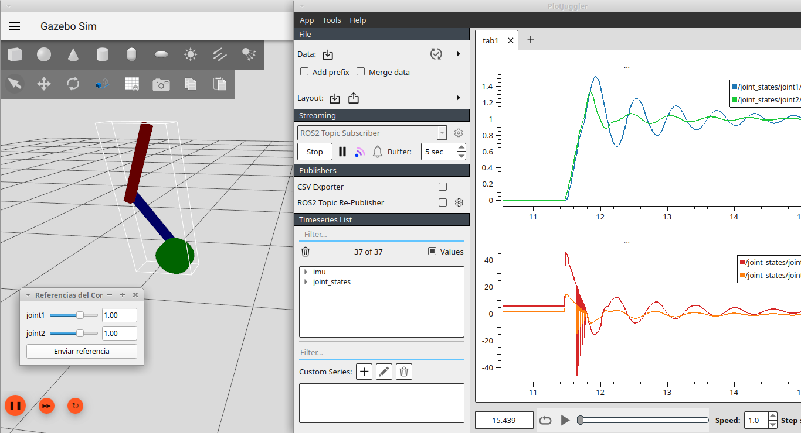
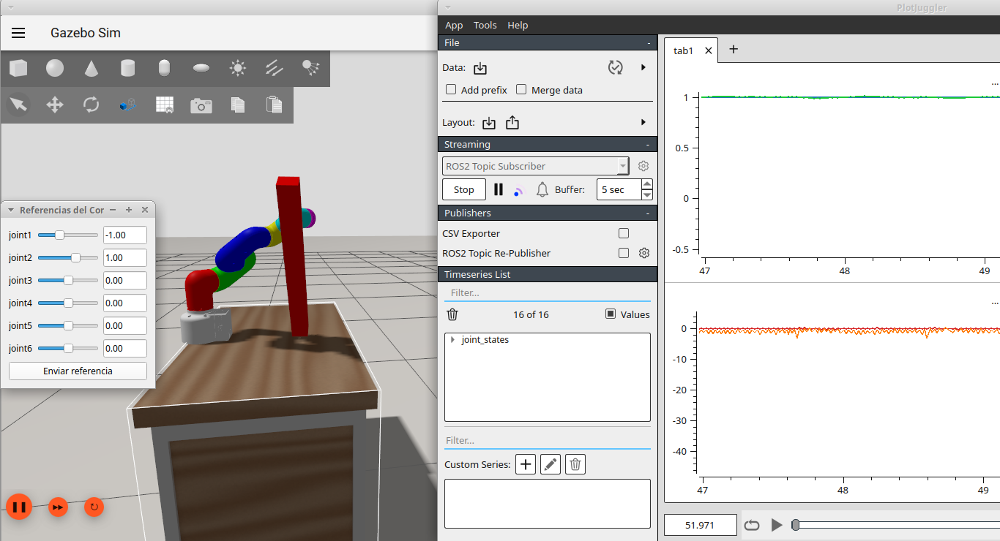
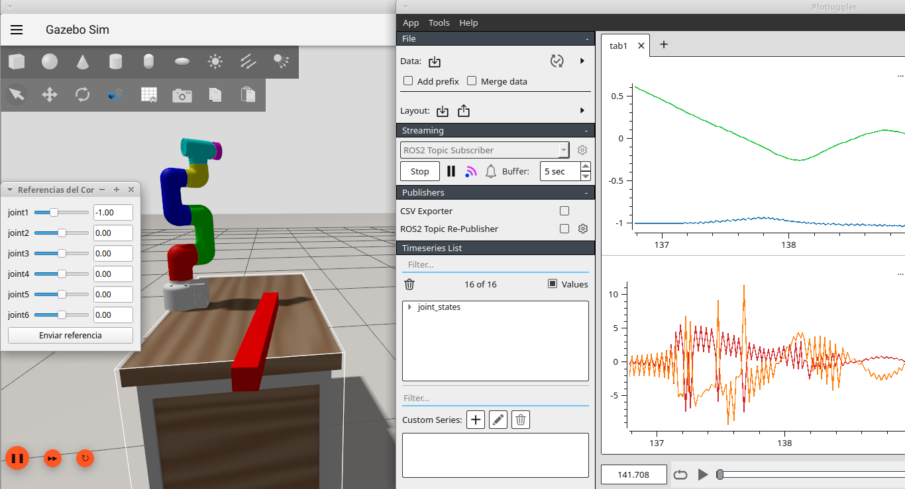

# Clase 6

## Objetivo

Esta clase presenta dos lanzadores de simulación que cargan robots definidos en XACRO/SDF, habilitan control por PID y ofrecen una interfaz gráfica para enviar referencias de articulación. Incluye visualización en RViz, simulación en `ros_gz_sim` y trazado de datos con PlotJuggler.

Notar que el nodo PID (pid_controller de ros2_controllers)
- recibe consigna de posición
- escribe effort a controller_manager



## Contenido

- `launch/dp_launch.py` — Simulación de un doble péndulo definido en `robot_description/dp/dp.xacro` con control PID desde `config/dp/ros2_controllers.yaml`.
- `launch/mycobot_launch.py` — Simulación de un robot MyCobot definido en `robot_description/mycobot_320_m5_2022/mycobot_320_m5_2022.xacro` con control PID desde `config/mycobot_320_m5_2022/ros2_controllers.yaml`.
- `scripts/gui_control.py` — Nodo Python que descubre `joint_states`, construye una GUI PyQt5 y publica referencias de articulación en `/pid_controller/reference`.
- `config/display.rviz` — Sesión de RViz usada por ambos lanzadores para visualizar `robot_description` y TF.
- `config/gazebo.config` — Configuración de la ventana de Gazebo/GZ para la simulación.
- `config/plotjuggler_layout.xml` — Layout cargado por PlotJuggler en el launch.
- `worlds/` — Mundos de Gazebo disponibles:
  - `mundo_vacio.world`
  - `mundo_suelo.world`
  - `mundo_escritorio.world`
  - `mundo_obstaculos.world`
- `models/Desk/` — Modelo de escritorio usado como recurso de entorno.

## Compilación

```bash
colcon build --packages-select clase6 --symlink-install
source install/setup.bash
```

## Ejecución

Lanzar el doble péndulo con su controlador y GUI de referencias:

```bash
ros2 launch clase6 dp_launch.py
```

Lanzar MyCobot con su controlador y GUI de referencias:

```bash
ros2 launch clase6 mycobot_launch.py
```

Variantes de ejecución:

```bash
ros2 launch clase6 dp_launch.py world_name:=mundo_obstaculos.world
ros2 launch clase6 mycobot_launch.py world_name:=mundo_escritorio.world
```

Ejecutar la GUI de control directamente:

```bash
ros2 run clase6 gui_control.py
```

## Qué explorar

- `launch/dp_launch.py` — cómo se construye `robot_description`, se lanza Gazebo y se conectan los spawners de controladores.
- `launch/mycobot_launch.py` — configuración del XACRO de MyCobot y el spawner de `pid_controller`.
- `scripts/gui_control.py` — descubrimiento de joints desde `/joint_states` y publicación de `MultiDOFCommand`.
- Correr los robots y hacer que golpeen los obstáculos que les dejamos listos para chocar en el mundo de Gazebo



